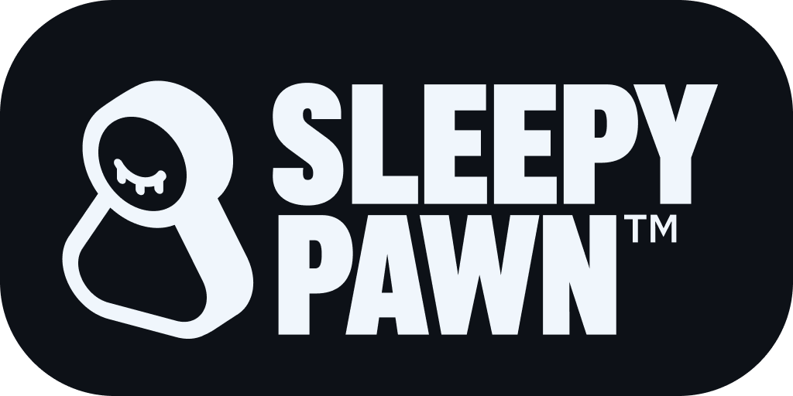

<!-- PROJECT LOGO -->
 

  
  

    
    
    
  

  <h3 align="center">Simple cross-platform C# chess engine.</h3>

  

    Play games via UCI, CLI and WebAssembly! Analyze positions and integrate anywhere!
     
    <a href="https://github.com/vorobiov-illia/sleepy-pawn/releases/latest"><strong>Download latest release »</strong></a>
     
     
    <a href="https://github.com/vorobiov-illia/sleepy-pawn/issues/new?labels=bug">Report Bug</a>
    &middot;
    <a href="https://github.com/vorobiov-illia/sleepy-pawn/issues/new?labels=enhancement">Request Feature</a>
  

## Contributing

Since **Sleepy Pawn** is my personal educational-demonstrational project, **Pull Requests are not accepted**.\
However, this project is still **open-source**. Fork it, break it, enhance it, it's cool!

Also, feel free to open issues or start discussions, I will try my best to enhance this project in my free time.

## License and Trademarks

The name **Sleepy Pawn™** and the Sleepy Pawn logos are the exclusive property of Illia Vorobiov.

While you are free to fork, modify, and distribute the source code under the [MIT](https://choosealicense.com/licenses/mit/) License, you may not use the **Sleepy Pawn™** name, logos, or associated branding in your own derived projects or forks. If you distribute a modified version of this software, please rename it and remove the original logos to avoid confusion.